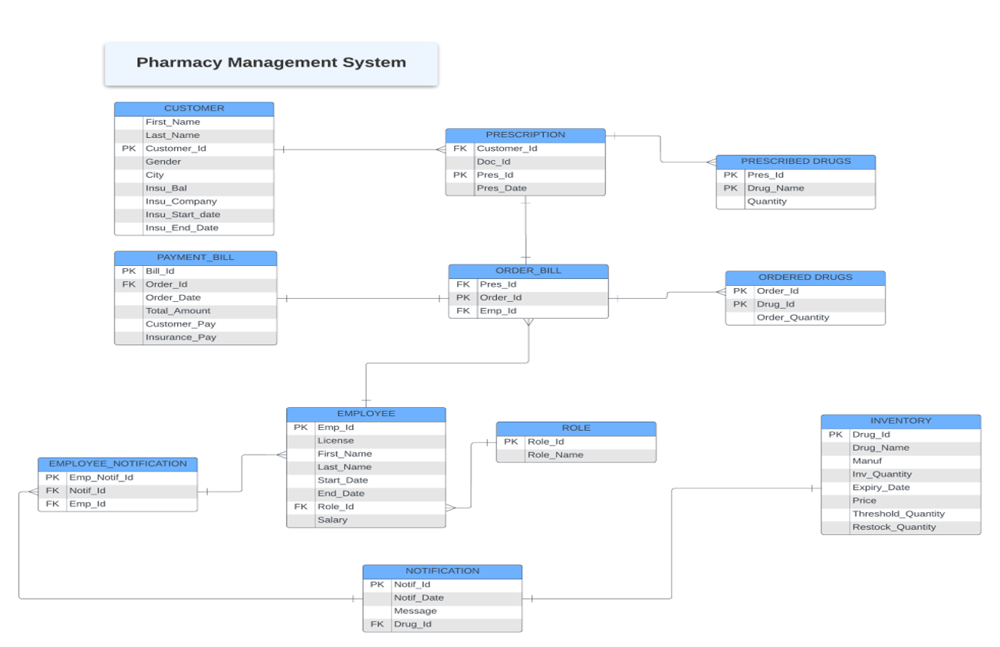

# 🏥 Pharmacy Management System – Database Design Project

## 📌 Overview

The **Pharmacy Management System** is a database-driven solution designed to automate and streamline pharmacy operations such as inventory management, customer records, prescriptions, billing, employee management, and reporting.
This project was developed as part of a multi-phase academic database design assignment and demonstrates end-to-end database design, implementation, security, and reporting using **Oracle SQL / PL/SQL**.

---

## 👥 Team Members

* **Ayush Yadav**
* **Sahil Mutha**
* **Akshay Datir**
* **Anusha Poojary**

Each team member actively contributed to database design, SQL development, testing, reporting, and Git version control.

---

## 🎯 Problem Statement

Manual pharmacy operations are prone to errors, inefficiencies, and delays in inventory tracking, customer billing, and prescription management. Lack of automation can result in stockouts, excess inventory, slow checkout processes, and inadequate reporting.

---

## ✅ Objectives

* Automate pharmacy operations using a centralized database
* Maintain accurate drug inventory and prevent stockouts
* Improve customer service through faster billing and record access
* Implement role-based security and controlled data access
* Provide meaningful reports and analytical views for decision-making

---

## 🛠️ Technology Stack

* **Database:** Oracle SQL
* **Procedural Language:** PL/SQL
* **Tools:** Oracle SQL Developer
* **Version Control:** Git & GitHub

---

## 🗂️ Database Design

### 🔗 Entity Relationship Diagram (ERD)

The ER diagram illustrates relationships between core entities such as Employee, Customer, Prescription, Inventory, Orders, Payments, and Roles.

📌 **ER Diagram:**


---

### 🔄 Data Flow Diagram (DFD)

The Data Flow Diagram represents how data flows across major modules of the system.

📌 **Modules Covered:**

* Customer Onboarding
* Order Management
* Inventory Management
* Billing & Payment Processing
* Notification System

📌 **DFD Diagram:**


---

## 🧱 Database Schema

The system consists of the following core tables:

* `EMPLOYEE`
* `ROLE`
* `CUSTOMER`
* `PRESCRIPTION`
* `INVENTORY`
* `ORDER_BILL`
* `ORDERED_DRUGS`
* `PAYMENT_BILL`
* `NOTIFICATIONS`

Each table is designed with appropriate primary keys, foreign keys, constraints, and relationships to enforce data integrity.

---

## 🔐 Security, Roles & Permissions

Role-based access control ensures secure and restricted access to sensitive data.

### 👤 Defined Roles

* **Pharmacy_Admin**

  * Full access to all tables
  * User and role management
* **Cashier**

  * Access to billing and customer orders
  * No access to inventory or employee salary data
* **Inventory_Manager**

  * Access to inventory and stock updates
  * Restricted from billing and payment details

---

## 📊 Views & Reports

The system includes analytical views to support business decisions:

### 1️⃣ Low Inventory Drugs

Identifies drugs below threshold levels to prevent stockouts.

### 2️⃣ Top 5 Customers by Order Value

Highlights high-value customers for loyalty and marketing strategies.

### 3️⃣ Employee Duration and Salary

Displays employee tenure and compensation details.

### 4️⃣ Customers with Maximum Orders

Identifies frequent customers to support retention strategies.

### 5️⃣ Top Performing Employees by Sales

Ranks employees based on generated sales revenue.

---

## ⚙️ Triggers

* **Low Inventory Trigger**
  Automatically generates notifications when drug stock falls below the threshold.

* **Employee Notification Trigger**
  Sends notifications to Admin and Inventory Manager roles when important system events occur.

---

## 📦 Stored Procedures & Packages

### 📦 Package: Order Management

Handles customer order operations.

**Procedures:**

* `INSERT_ORDER_BILL`
* `UPDATE_ORDER_BILL`
* `DELETE_ORDER_BILL`

---

### 📦 Package: User Management

Manages customer records.

**Procedures:**

* `CREATE_CUSTOMER`
* `DELETE_CUSTOMER`

---

## 🧪 Sample Data

Each table includes **5–10 sample records** to:

* Validate table relationships
* Test triggers and procedures
* Execute views and reports successfully

---

## ▶️ How to Run the Project

### Step 1: Create Tables & Objects

```sql
Final_Project.sql
```

### Step 2: Insert Sample Data

```sql
Data_insertion_in_all_tables.sql
```

### Step 3: Create Users & Roles

```sql
Pharmacy_Admin_User1.sql
```

### Step 4: Create Triggers

```sql
Triggers_Low_Inventory.sql
Triggers_Sending_Notif_to_emp.sql
```

### Step 5: Execute Packages

```sql
Package/Role_and_Emp_Creation_Package.sql
```

> ✅ All scripts are **rerunnable** and execute without ORA errors.

---

## 📈 Project Highlights

* End-to-end database lifecycle implementation
* Secure role-based access control
* Business-driven reporting & analytics
* Automated alerts via triggers
* Fully version-controlled with consistent Git contributions

---

